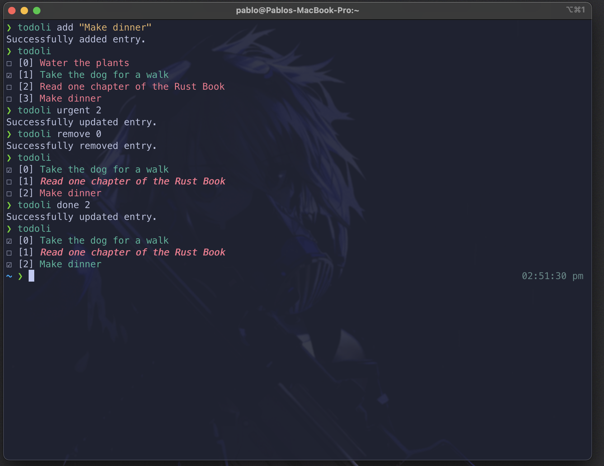

# todoli
## A simple CLI tool for keeping track of your tasks.

Built in Rust using clap, **todo** allows for todo lists to be created, viewed, and checked off all from the **command line**.



## Usage
```
USAGE:
    todoli [OPTIONS] [SUBCOMMAND]

OPTIONS:
    -h, --help           Print help information
    -p, --path <PATH>    Creates or modifies todo list at specified path [default: $HOME/.todo]
    -V, --version        Print version information

SUBCOMMANDS:
    add       Adds entry to todo list
    clear     Removes all entries from todo list
    done      Marks item with id as done on todo list
    help      Print this message or the help of the given subcommand(s)
    remove    Removes entry with id from todo list
    urgent    Marks item with id as urgent on todo list
```


## Installation
Todoli can be installed by building from the latest source using **cargo**.

#### Quickstart
```
git clone https://github.com/pablolafontaine/todoli.git
cd todoli
cargo run -- [OPTIONS] [SUBCOMMAND]
For Example: cargo run -- -p todo-list add "Go for a walk"
```
 
#### Linux/Mac Install
```
git clone https://github.com/pablolafontaine/todoli.git
cd todoli
cargo build --release
sudo cp target/release/todoli /usr/local/bin
```
